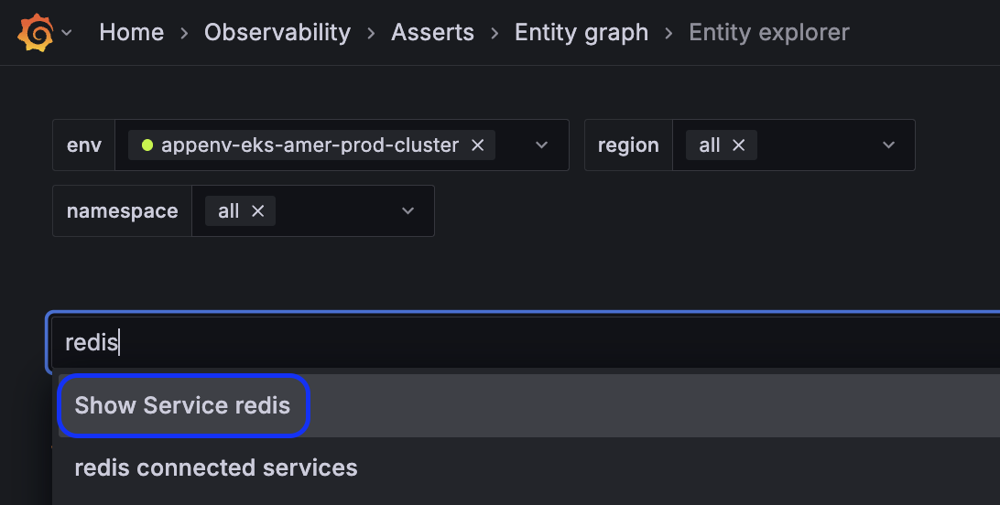
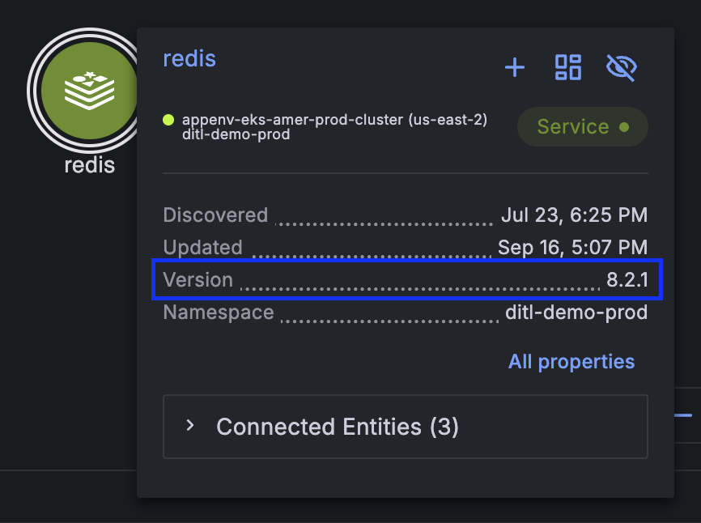
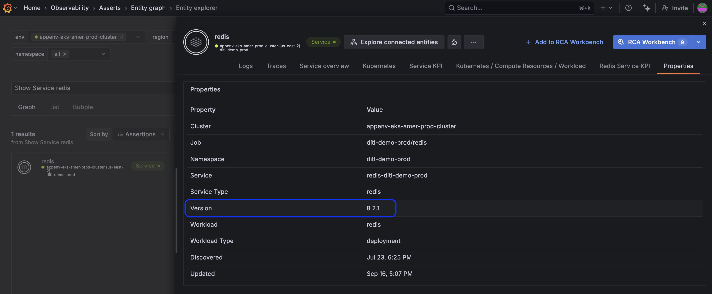

## Knowledge Graph
Q: Which version of Redis is deployed?

A: 8.2.1

To find this:
- Type `redis` into the main search bar and select `Show Service redis` from the drop down

- Hover over the entity and see that the version is 8.2.1

- An alterative way to see this is click `show more`` and this takes you to the full properties page where it also shows this and other properties

