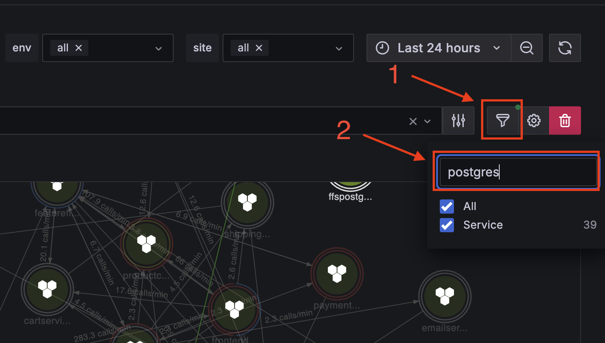
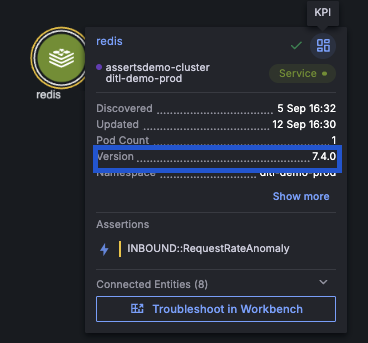
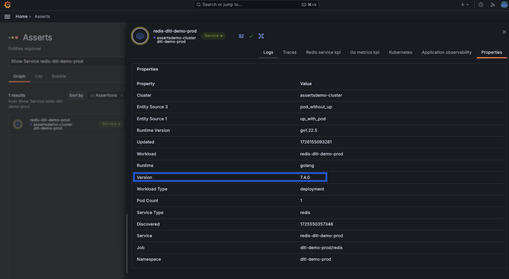

## Asserts
Q: What is the maximum limit of postgres connections in the productcatalog postgres database?

A: 100

To find this:
- Search for `postgres` in the upper right hand corner.

- Click on the `productcatalog-postgres-ditl-demo-prod` service in the Graph results list on the right, then select `datasources` in the drop down.

- Then click the `ditl-demo-prod:productcatalog` entity KPI icon, which will open up to the `Postgresql KPI` dashboard.

- Within the dashboard there will be a panel for `Max Connections` which will display 100.
