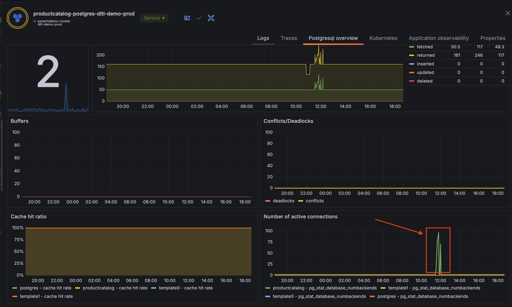

## Asserts
Q: What is the maximum limit of postgres connections in the productcatalog postgres database?

A: 100

To find this:
- Open the RCA workbench for the `productcatalog-postgres-ditl-demo-prod` service.

This value can be deduced in one of two ways:
1. In the RCA Workbench 
    - Click open the `Summary` tab in RCA Workbench and expand the assertions for the above service. 
    - Expand the assertion for `PostgreSQLHighConnections` and view the graph to the right.
    - Note that the number of connections never goes past 100, especially during spiky behavior.
    
2. In the KPI Drawer
    - Click on the KPI icon on the `productcatalog-postgres-ditl-demo-prod` service. (This can also be done in the Entity Graph view if you find it there first).
    
    - Open the `PostgreSQL overview` tab in the KPI Drawer and scroll down to the `Number active of connections panel`.
    - Here you can note that the number of connections never goes past 100 either, even with the spiky behavior.
    
